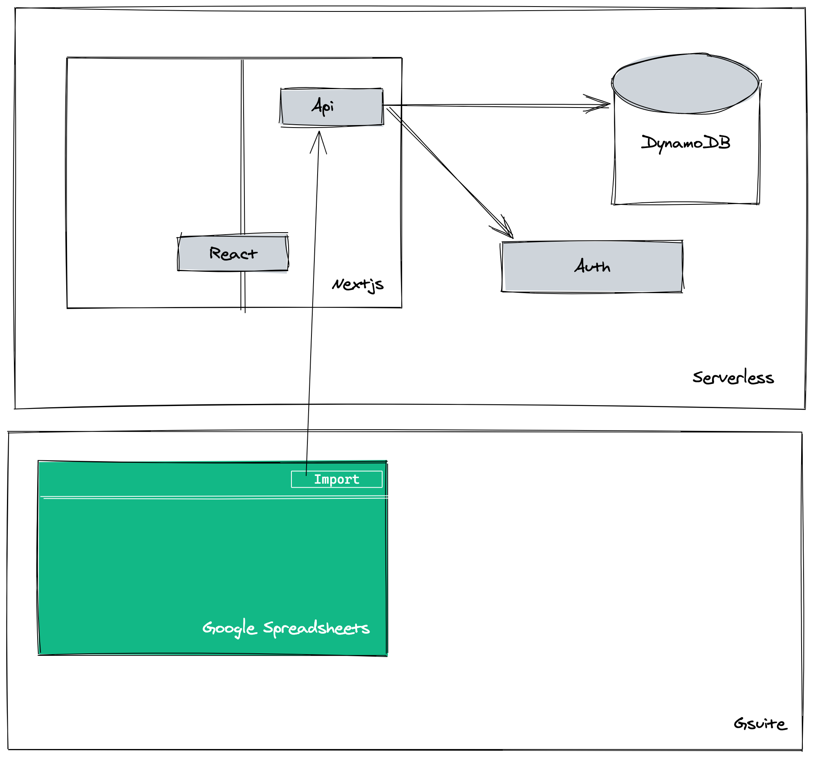

# timesheets.ingenious.agency

A web app that allows users to upload their timesheets (like the CSV ones you get form Toggl) into a database to be consumed later by a Google App Script.

## Motivation

There are two main drivers for building this app. Timesheet creation and management at Ingenious is pretty basic, we share our hours with admin staff, and they manually upload the info into a spreadsheet they use to do their calculations. We can do this in a better way.

The second motivation is to work on this in the open, on my [Twitch channel](https://www.twitch.tv/iamcherta), and share how I approach these types of applications using React, Next, and other technologies that I find interesting.

## Design

What we are looking for is the automation of timesheet submission and prevent the hassle of continuously ask employees to send their work hours. Ideally, the app makes this part of the timesheet submission process automatic.

The idea is pretty basic. The app should be able to login users from a configurable domain, and once logged in, it should let you import a CSV, map the columns into the ones the system support, and upload the timesheet to a DB.

After the import is done, an admin person should be able to retrieve the timesheet into a Google Spreadsheet, and from there, let admin staff continue with their regular workflow.

## Architecture

## Roadmap

- [x] Create a component that receives a file and parses a CSV into a JS object
- [ ] Allow rows deletion and ammend
- [ ] Allow users to map their columns with the ones the system supports
- [ ] Allow users to submit their timesheet
- [ ] Allow admin staff to retrieve timesheets from within Google Spreadhseets
